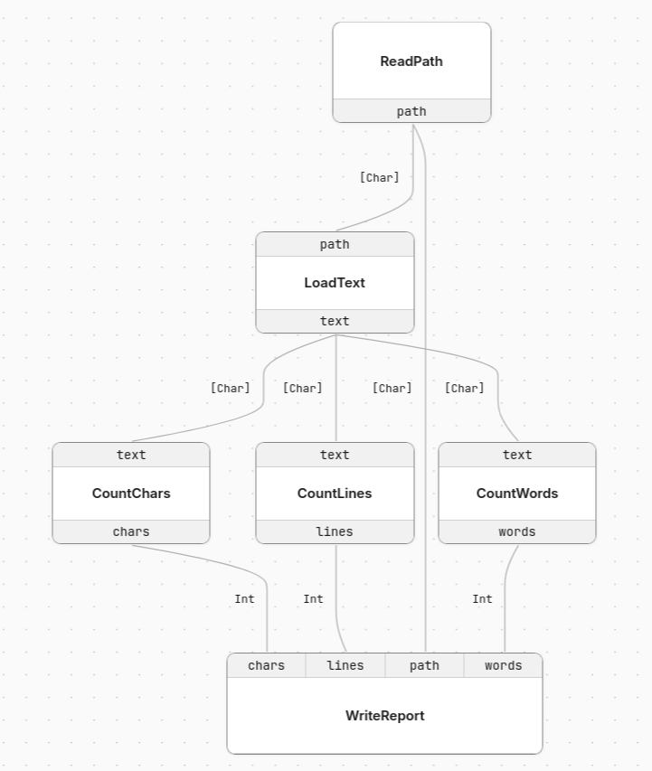

<p align="center">
  
</p>

# wirecat

`wirecat` is a GHC plugin and small library for writing typed categorical
wiring diagrams with a restricted fragment of Haskell `proc` notation. A
single pipeline can be interpreted as executable code or rendered as a graph.

The notation currently covers the cartesian part of the language: composition,
projection, product-like combination, field relabeling, and primitive
operations. Case analysis is the next missing piece for the bicartesian side.

## Example

```haskell
{-# LANGUAGE Arrows #-}
{-# OPTIONS_GHC -fplugin=WireCat #-}

import WireCat

wordCount :: WordCount :> cat => cat Empty Empty
wordCount = proc R {} -> do
  R {path} <- interpret ReadPath -< R {}
  R {text} <- interpret LoadText -< R {path}
  R {words} <- interpret CountWords -< R {text}
  R {lines} <- interpret CountLines -< R {text}
  R {chars} <- interpret CountChars -< R {text}
  interpret WriteReport -< R {path, words, lines, chars}
```

That same definition can be run with a concrete interpreter, captured as a free
categorical term, or exported as DOT, SVG, and JSON for the React viewer:

<p align="center">
  
</p>

## Commands

```sh
cabal build all
cabal test all
cabal run examples -- word-count graph
just viewer-dev
```

Generated example graphs are written to `tmp/`.
